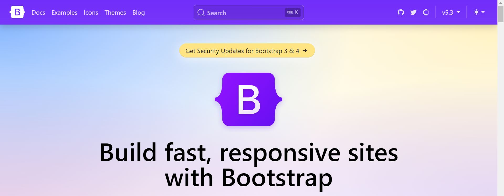
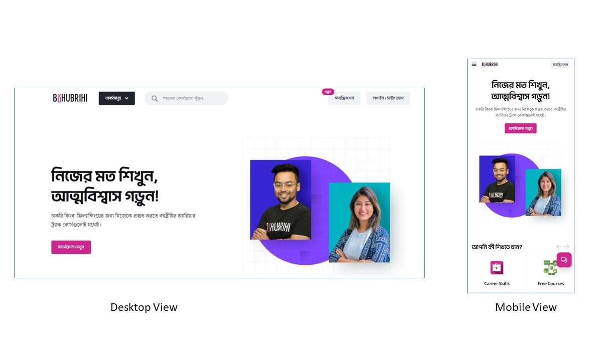

# Web development career discussions and making a demo portfolio project

## Introduction to Bootstrap



### Why Bootstrap?

Bootstrap is a widely-used front-end framework that makes web development faster and easier. Here are some reasons why Bootstrap is beneficial:

1. **Responsive Design**: Ensures your website looks great on all devices, from phones to desktops.
2. **Pre-designed Components**: Comes with pre-styled components like buttons, forms, navbars, and modals.
3. **Consistency**: Maintains a consistent design across all web pages.
4. **Cross-browser Compatibility**: Addresses many browser inconsistencies.
5. **Ease of Use**: Simple to learn and implement, ideal for beginners.



### Integrating Bootstrap into an HTML File

To integrate Bootstrap into your HTML file, follow these steps:

1. **Add Bootstrap CSS**: Include the Bootstrap CSS file in the `<head>` section of your HTML.
2. **Add Bootstrap JS**: Include the Bootstrap JavaScript and its dependencies at the bottom of the `<body>`.

Here is an example HTML file with Bootstrap integrated:

```html
<!DOCTYPE html>
<html lang="en">
<head>
    <meta charset="UTF-8">
    <meta name="viewport" content="width=device-width, initial-scale=1.0">
    <title>Bootstrap Integration Example</title>
    <!-- Bootstrap CSS -->
    <link href="https://stackpath.bootstrapcdn.com/bootstrap/5.3.0/css/bootstrap.min.css" rel="stylesheet">
</head>
<body>

    <h1 class="text-center">Hello, Bootstrap!</h1>

    <!-- Bootstrap JS and dependencies -->
    <script src="https://code.jquery.com/jquery-3.6.0.min.js"></script>
    <script src="https://cdn.jsdelivr.net/npm/@popperjs/core@2.11.6/dist/umd/popper.min.js"></script>
    <script src="https://stackpath.bootstrapcdn.com/bootstrap/5.3.0/js/bootstrap.min.js"></script>
</body>
</html>
```

# Creating a Portfolio Website Using Bootstrap

Let's create a portfolio website step by step using Bootstrap.

## Creating the Navbar

A navbar allows users to navigate through different sections of your website. Here's how to create a simple responsive navbar:

```html
<!DOCTYPE html>
<html lang="en">
<head>
    <meta charset="UTF-8">
    <meta name="viewport" content="width=device-width, initial-scale=1.0">
    <title>Portfolio Website</title>
    <!-- Bootstrap CSS -->
    <link href="https://stackpath.bootstrapcdn.com/bootstrap/5.3.0/css/bootstrap.min.css" rel="stylesheet">
</head>
<body>

    <!-- Navbar -->
    <nav class="navbar navbar-expand-lg navbar-light bg-light">
        <div class="container-fluid">
            <a class="navbar-brand" href="#">My Portfolio</a>
            <button class="navbar-toggler" type="button" data-bs-toggle="collapse" data-bs-target="#navbarNav" aria-controls="navbarNav" aria-expanded="false" aria-label="Toggle navigation">
                <span class="navbar-toggler-icon"></span>
            </button>
            <div class="collapse navbar-collapse" id="navbarNav">
                <ul class="navbar-nav">
                    <li class="nav-item">
                        <a class="nav-link active" aria-current="page" href="#">Home</a>
                    </li>
                    <li class="nav-item">
                        <a class="nav-link" href="#about">About</a>
                    </li>
                    <li class="nav-item">
                        <a class="nav-link" href="#projects">Projects</a>
                    </li>
                    <li class="nav-item">
                        <a class="nav-link" href="#skills">Skills</a>
                    </li>
                    <li class="nav-item">
                        <a class="nav-link" href="#certifications">Certifications</a>
                    </li>
                    <li class="nav-item">
                        <a class="nav-link" href="#experience">Experience</a>
                    </li>
                    <li class="nav-item">
                        <a class="nav-link" href="#education">Education</a>
                    </li>
                    <li class="nav-item">
                        <a class="nav-link" href="#contact">Contact</a>
                    </li>
                </ul>
            </div>
        </div>
    </nav>

    <!-- Bootstrap JS and dependencies -->
    <script src="https://code.jquery.com/jquery-3.6.0.min.js"></script>
    <script src="https://cdn.jsdelivr.net/npm/@popperjs/core@2.11.6/dist/umd/popper.min.js"></script>
    <script src="https://stackpath.bootstrapcdn.com/bootstrap/5.3.0/js/bootstrap.min.js"></script>
</body>
</html>
```

## Creating the Home Section

The home section is the first thing visitors see. It usually contains a welcoming message or an introduction.

```javascript
<!-- Home Section -->
<section id="home" class="text-center py-5 bg-light">
    <div class="container">
        <h1>Welcome to My Portfolio</h1>
        <p class="lead">I am a [Your Profession]</p>
    </div>
</section>
```

## Creating the About Section

The about section provides information about you, your background, and your interests.


```html
<!-- About Section -->
<section id="about" class="py-5">
    <div class="container">
        <h2>About Me</h2>
        <p>Write a brief introduction about yourself here.</p>
    </div>
</section>
```

## Creating the Projects Section

The projects section showcases your work and accomplishments.


```html
<!-- Projects Section -->
<section id="projects" class="py-5 bg-light">
    <div class="container">
        <h2>Projects</h2>
        <div class="row">
            <div class="col-md-4">
                <div class="card">
                    
                    <div class="card-body">
                        <h5 class="card-title">Project 1</h5>
                        <p class="card-text">Brief description of Project 1.</p>
                    </div>
                </div>
            </div>
            <div class="col-md-4">
                <div class="card">
                    
                    <div class="card-body">
                        <h5 class="card-title">Project 2</h5>
                        <p class="card-text">Brief description of Project 2.</p>
                    </div>
                </div>
            </div>
            <div class="col-md-4">
                <div class="card">
                    
                    <div class="card-body">
                        <h5 class="card-title">Project 3</h5>
                        <p class="card-text">Brief description of Project 3.</p>
                    </div>
                </div>
            </div>
        </div>
    </div>
</section>
```

## Creating the Skills Section

The skills section lists your professional skills and proficiencies.

```javascript
<!-- Skills Section -->
<section id="skills" class="py-5">
    <div class="container">
        <h2>Skills</h2>
        <ul class="list-unstyled">
            <li>Skill 1</li>
            <li>Skill 2</li>
            <li>Skill 3</li>
        </ul>
    </div>
</section>
```

## Creating the Certifications Section

The certifications section highlights your relevant certifications.

```javascript
<!-- Certifications Section -->
<section id="certifications" class="py-5 bg-light">
    <div class="container">
        <h2>Certifications</h2>
        <ul class="list-unstyled">
            <li>Certification 1</li>
            <li>Certification 2</li>
            <li>Certification 3</li>
        </ul>
    </div>
</section>
```

## Creating the Experience Section

The experience section details your professional experience and roles.

```javascript
<!-- Experience Section -->
<section id="experience" class="py-5">
    <div class="container">
        <h2>Experience</h2>
        <ul class="list-unstyled">
            <li>Job Title 1 at Company 1 (Date - Date)</li>
            <li>Job Title 2 at Company 2 (Date - Date)</li>
            <li>Job Title 3 at Company 3 (Date - Date)</li>
        </ul>
    </div>
</section>
```

## Creating the Education Section

The education section lists your academic background and qualifications.


```html
<!-- Education Section -->
<section id="education" class="py-5 bg-light">
    <div class="container">
        <h2>Education</h2>
        <ul class="list-unstyled">
            <li>Degree 1 from Institution 1 (Date - Date)</li>
            <li>Degree 2 from Institution 2 (Date - Date)</li>
            <li>Degree 3 from Institution 3 (Date - Date)</li>
        </ul>
    </div>
</section>
```

## Creating the Footer Section

The footer section provides additional information like contact details or social media links.

```html
<!-- Footer Section -->
<footer class="py-4 bg-dark text-white text-center">
    <div class="container">
        <p>© 2023 My Portfolio. All rights reserved.</p>
        <p>Follow me on:
            <a href="#" class="text-white">LinkedIn</a> |
            <a href="#" class="text-white">Twitter</a> |
            <a href="#" class="text-white">GitHub</a>
        </p>
    </div>
</footer>

<!-- Bootstrap JS and dependencies -->
<script src="https://code.jquery.com/jquery-3.6.0.min.js"></script>
<script src="https://cdn.jsdelivr.net/npm/@popperjs/core@2.11.6/dist/umd/popper.min.js"></script>
<script src="https://stackpath.bootstrapcdn.com/bootstrap/5.3.0/js/bootstrap.min.js"></script>
</body>
</html>
```

# Conclusion

With this step-by-step guide, customize each section further to reflect your unique style and professional achievements. Bootstrap's extensive documentation and community support will be valuable resources as they continue to develop their web design skills.
